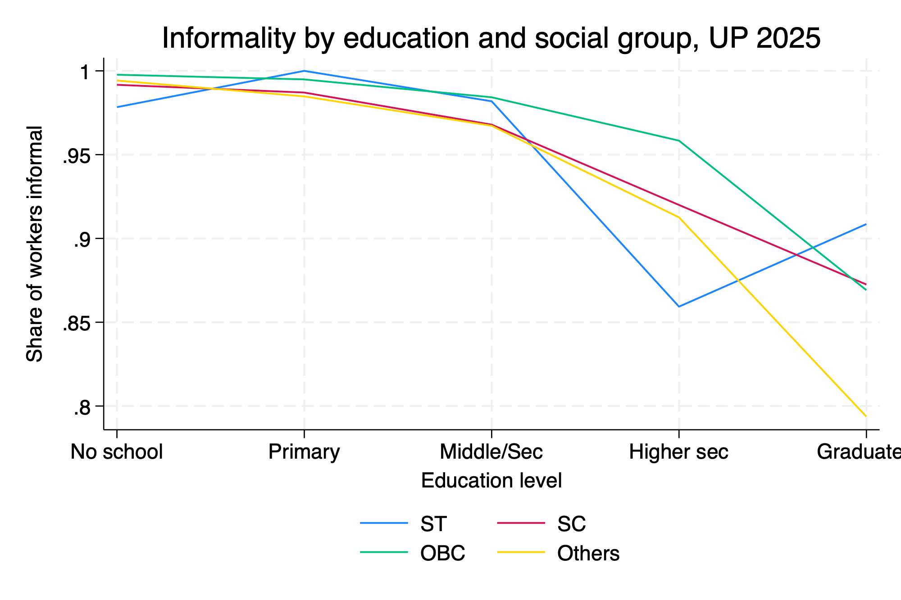

# Left out of protection: social group, informality and earnings in Uttar Pradesh
### Evidence from PLFS 2025

Uttar Pradesh's workforce of 68 million is almost entirely informal: 96% of workers lack a written contract, employer-provided social security, or a registered employer. This project uses Periodic Labour Force Survey (PLFS) 2025 microdata to ask who gets left out of protected work, whether education closes the gap, and how the penalty shows up in earnings. Formal work turns out to be distributed along social group lines, and the inequality *widens* with education. Earnings gaps of 13–18% persist between social groups even among workers with identical education, age, sex, and location.

## Key findings

- **Formal work is rare, and rarest for SC, ST, and OBC workers.** Informality is 95.9% overall; a worker from the Others group is roughly three times as likely to hold a formal, protected job as an SC, ST, or OBC worker.
- **Education raises formality for everyone; but unequally.** Social group gaps are negligible below secondary education and widen to 8–11 percentage points among graduates: the higher the education level, the more unequal the access to protected work.
- **Protection pays, and its absence is expensive.** Formal workers earn nearly three times what informal workers earn (₹34,646 vs ₹11,850 per month). Controlling for education, age, sex, and location, SC, ST, and OBC workers still earn 13–18% less than comparable Others workers,  a penalty that, unlike the protection gap, survives all controls.

## Data

PLFS 2025 microdata (Ministry of Statistics and Programme Implementation, Government of India), calendar year January–December 2025, Uttar Pradesh sample: 176,060 individuals in 36,774 households. Raw microdata is **not redistributed** in this repository per MoSPI usage terms, it can be obtained from [microdata.gov.in](https://microdata.gov.in).

## Reproducibility

Run the three do-files in order:

1. `01_import_merge.do` : cuts the all-India files to Uttar Pradesh and merges person- and household-level records
2. `02_variables.do` : builds all analysis variables, including the informality classification (ILO-framework logic: contract/social security tests for wage workers; enterprise-type test for the self-employed) and a harmonised monthly earnings measure across salaried, casual, and self-employed workers
3. `03_codes_tables.do` : produces every table, figure, and regression in the note

Complete output is in `all_tables.txt`. As a validation check, the pipeline reproduces the published PLFS Annual Report worker-population ratio for Uttar Pradesh (ages 15+, usual status ps+ss) of 53.7% to the decimal.

## Author

**Dopal Gupta** : researcher working on poverty, social protection, and welfare delivery in India. This project grew out of working with the household survey data from low-income constituencies of Bihar(Mahnar), East Delhi, and Madhya Pradesh, where the gap between entitlement on paper and protection in practice kept repeating itself. Incoming MSc in Development Studies (Applied Development Economics), London School of Economics, September 2026.

Contact: dopalgupta@gmail.com · dopalgupta
